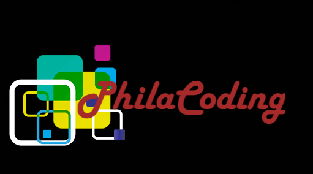

<div align="center">



#  Philacoding School & Organisation Digital Platforms

**Building modern websites, full-stack applications, and complete digital platforms for schools, organisations, businesses, and institutions.**

</div>

---

## 🌐 About Philacoding

**Philacoding** designs and develops modern digital solutions that go beyond traditional websites.

We build everything from professional public-facing websites to **complete full-stack digital platforms** incorporating online applications, assessments, authentication, APIs, databases, dashboards, data processing, automation, and other digital services.

This repository contains the ongoing development of the **Siphesihle High School Website & Digital Platform**.

---

# 🏫 Featured Project

## Siphesihle High School Website & Digital Platform

A modern school website being developed as the foundation for a broader digital platform serving learners, parents, teachers, prospective applicants, alumni, and the wider school community.

### Current Features

* 🏠 School information
* 📚 Academics
* 👨‍🏫 Leadership & staff
* 👨‍👩‍👧 Parents
* 🎓 Alumni
* ⚽ Sports
* 📅 Events
* 📝 Online applications
* 💻 Online assessments
* 📞 Contact information
* 📱 Responsive web design

### 🔗 Project Links

**Live Website:**
https://philacoding.github.io/philacoding-school-platiform/

**GitHub Repository:**
https://github.com/PHILACODING/philacoding-school-platiform

---

# 💻 Philacoding Developer Platform

The **Philacoding Developer Platform** is a separate project focused on software development, programming, data engineering, artificial intelligence, machine learning, and developer resources.

It serves as a platform for developing and demonstrating software engineering knowledge, projects, tools, APIs, and intelligent digital solutions.

### 🔗 Project Links

**Developer Platform:**
https://github.com/PHILACODING/Philacoding_Developer_Platform

**GitHub Organisation:**
https://github.com/PHILACODING

---

# 🏗️ What Philacoding Builds

Philacoding focuses on developing **complete digital solutions**, rather than only static websites.

## 🌐 Websites

Professional websites for:

* 🏫 Schools
* 🏢 Businesses
* 🌍 Organisations
* 🏛️ Institutions
* 🤝 Community organisations
* 📚 Educational platforms
* 👤 Personal & professional brands

---

## 🖥️ Full-Stack Digital Systems

Complete systems can be built around an architecture such as:

```text
Frontend
    ↓
Backend
    ↓
REST APIs
    ↓
Business Logic
    ↓
Database
    ↓
Authentication & Authorisation
    ↓
Dashboards & Digital Services
    ↓
Deployment
```

The exact architecture and technology stack depends on the requirements of each project.

---

## 📝 Online Application Systems

Digital application platforms can include:

* Online application forms
* Applicant registration
* Form validation
* Document submission
* Application tracking
* Application status
* Administrative review
* Database storage

---

## 🧠 Online Assessment Systems

Digital assessment platforms can include:

* Online tests
* Question banks
* Multiple-choice questions
* Learner submissions
* Automatic marking
* Results
* Assessment history
* Teacher and administrator management

---

## 📊 Data & Business Systems

Philacoding can also develop systems incorporating:

* SQL databases
* Data processing
* Data pipelines
* Dashboards
* Reporting
* Data analysis
* Power BI
* APIs
* Automation
* Business intelligence

---

# 🛠️ Technology Stack

The technology stack is selected according to the **requirements, functionality, scale, security, and deployment environment** of each project.

### Frontend

* HTML5
* CSS3
* JavaScript
* Responsive Web Design

### Backend

* Python
* FastAPI
* REST APIs
* Backend services

### Databases & Data

* SQL
* PostgreSQL
* MySQL
* Data pipelines
* Data analytics

### AI & Machine Learning

* Python
* Pandas
* NumPy
* Scikit-learn
* Machine Learning
* Generative AI
* LLM applications

### Development & Deployment

* Git
* GitHub
* Docker
* Cloud platforms
* CI/CD
* API integrations

---

# 🏫 Siphesihle High School Platform — Roadmap

The Siphesihle High School project is being developed incrementally, allowing new functionality to be introduced as the platform evolves.

## Phase 1 — Public Website ✅

* [x] School homepage
* [x] School information
* [x] Academics
* [x] Leadership
* [x] Parents
* [x] Alumni
* [x] Sports
* [x] Events
* [x] Contact information
* [x] Responsive design
* [x] GitHub repository
* [x] Live deployment

## Phase 2 — Online Applications 🚧

* [ ] Application forms
* [ ] Applicant information
* [ ] Document submission
* [ ] Form validation
* [ ] Application database
* [ ] Application status
* [ ] Administration interface

## Phase 3 — Online Assessments 🚧

* [ ] Assessment system
* [ ] Question management
* [ ] Learner submissions
* [ ] Automatic marking
* [ ] Results
* [ ] Assessment history

## Phase 4 — Full-Stack Platform 🚧

* [ ] Backend API
* [ ] Database
* [ ] User authentication
* [ ] Learner accounts
* [ ] Parent accounts
* [ ] Teacher accounts
* [ ] Administrator accounts
* [ ] Dashboards
* [ ] Role-based access

## Phase 5 — Advanced Digital Services 🚀

Future functionality may include:

* 📊 Learner performance dashboards
* 📚 Digital learning resources
* 📝 Assignments
* 🔔 Notifications
* 📅 School calendar
* 📈 Academic analytics
* 🤖 AI-powered services
* 📧 Communication tools
* 🏫 School administration tools

---

# 🔄 Development Philosophy

Philacoding follows an **iterative development approach**.

A digital platform does not need to be completely finished before it can start providing value.

Projects can begin with a functional website and progressively evolve into more advanced digital systems.

```text
Plan
  ↓
Build
  ↓
Test
  ↓
Deploy
  ↓
Collect Feedback
  ↓
Improve
  ↓
Repeat
```

This approach allows organisations to introduce digital services progressively while continuously improving the platform.

---

# 💻 Development Workflow

Projects are managed using Git and GitHub.

```bash
git status

git add .

git commit -m "Describe the changes"

git push
```

Changes can then be deployed to the live environment as development progresses.

---

# 🔐 Security & Privacy

For systems handling sensitive information, security and privacy are considered throughout the development lifecycle.

Sensitive information should **never** be committed to GitHub, including:

* Passwords
* API keys
* Database credentials
* Authentication secrets
* `.env` files
* Private user information
* Confidential organisational records

Production systems should use appropriate:

* Authentication
* Authorisation
* Secure configuration
* Database security
* Access controls
* Environment management
* Deployment security

---

# 🎯 Philacoding's Vision

The goal is to help organisations move beyond having **"just a website."**

A modern organisation can have an integrated digital environment where its website connects to the services and systems it needs.

```text
                    ORGANISATION
                         │
             ┌───────────┴───────────┐
             ↓                       ↓
      PUBLIC WEBSITE          DIGITAL SERVICES
             │                       │
             ↓                       ↓
    Information & Content     Online Applications
                                     │
                                     ↓
                              Online Assessments
                                     │
                                     ↓
                                  Accounts
                                     │
                                     ↓
                                  Database
                                     │
                                     ↓
                                 Dashboards
                                     │
                                     ↓
                              Administration
```

Philacoding aims to build these systems as **connected, scalable, and practical full-stack digital platforms**.

---

# 👨‍💻 About Philacoding

**Philacoding** is a software development and technology initiative focused on building practical digital solutions.

### Areas of Development

* 🌐 Web Development
* 🖥️ Full-Stack Software Development
* 🗄️ Database Systems
* 📊 Data Analytics
* 🔧 Data Engineering
* ☁️ Cloud Technologies
* 🤖 Artificial Intelligence
* 🧠 Machine Learning
* 🔌 APIs & Integrations
* ⚙️ Automation

---

# 🔗 Philacoding Links

### 🏫 Siphesihle High School Website

https://philacoding.github.io/philacoding-school-platiform/

### 💻 Philacoding Developer Platform

https://github.com/PHILACODING/Philacoding_Developer_Platform

### 🐙 Philacoding GitHub

https://github.com/PHILACODING

### 🌐 Philacoding Website

https://www.philacoding.com

---

# 🚀 Projects in Development

This repository is part of a growing collection of **Philacoding projects** designed to demonstrate practical software engineering, data, artificial intelligence, and digital-platform development.

The long-term objective is to create useful technology that solves real problems for schools, organisations, businesses, and communities.

```text
Build
  ↓
Deploy
  ↓
Learn
  ↓
Improve
  ↓
Repeat
```

---

<div align="center">

## 🚀 Philacoding

**Building digital platforms for schools, organisations, businesses, and institutions.**

</div>
